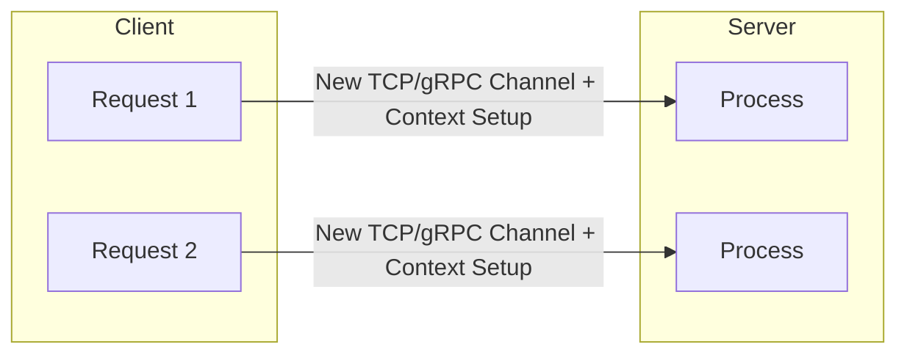
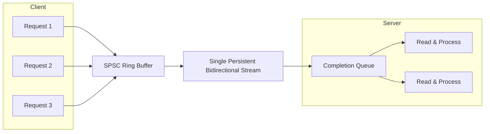
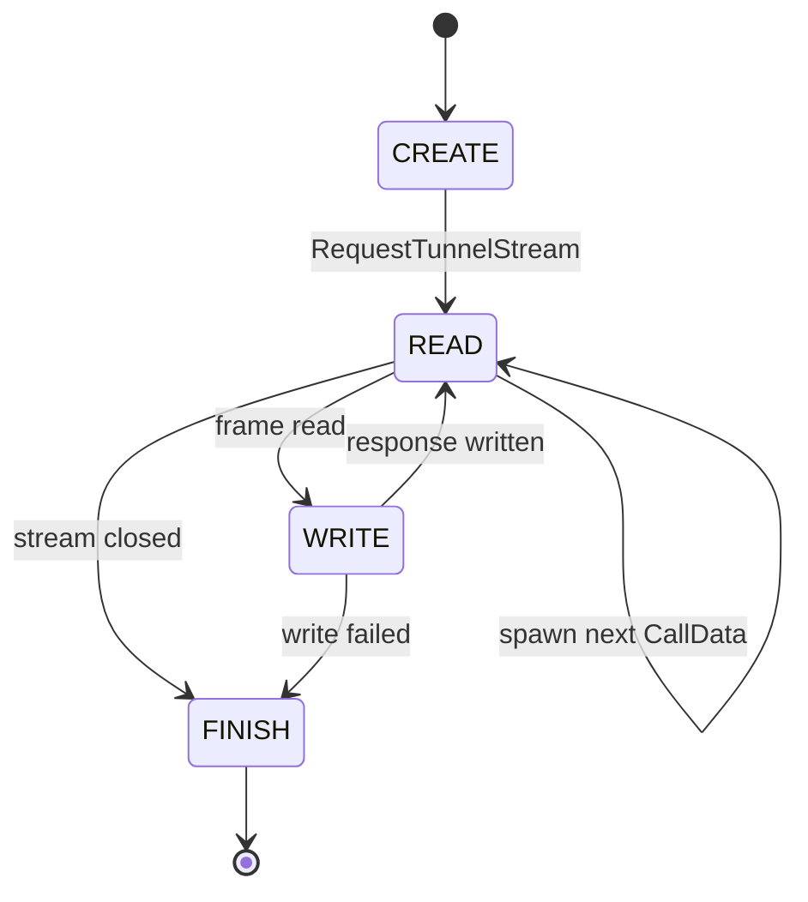
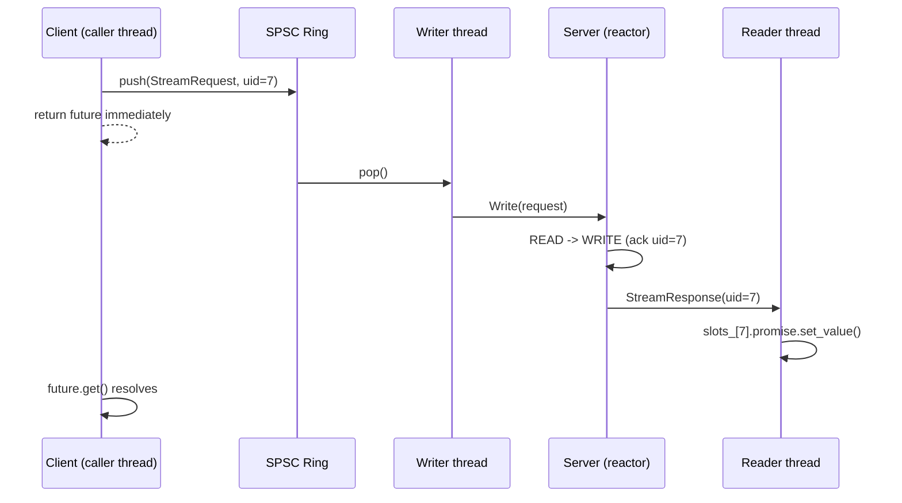

# Thousands of Requests, One Stream: Building a Lock-Free Multiplexed gRPC Proxy 
Every unary gRPC call pays a toll before it does any useful work. A new HTTP/2 stream gets opened on the connection, a `ClientContext` gets allocated, headers get framed and sent, and only then does the actual request go out. For a web backend making a handful of calls a second, this toll is invisible. For an order-entry system firing thousands of messages a second, it is the whole bottleneck.

I built a proxy that removes the toll entirely: one persistent, bidirectional gRPC stream, multiplexing an arbitrary number of independent logical requests, with a lock-free pipeline on the way in and zero-allocation correlation on the way back. Here is how it works, and what it bought me.

## The problem with one stream per call



Each unary call is its own HTTP/2 stream on the shared channel. That means its own stream ID, its own header frame, its own `ClientContext` allocation, and its own round trip through gRPC's call machinery before the first byte of payload moves. None of that work is shared across calls. Send ten thousand orders and you pay the setup cost ten thousand times.

The fix is to stop treating each request as its own call. Open one stream, keep it open, and tag every message travelling over it with a correlation ID so responses can find their way back to the right caller, in whatever order they arrive.



## The wire format

Two message types do all the work. Every frame in either direction carries a 64-bit `client_uid`, chosen on purpose over a string UUID because a fixed-width integer needs no heap allocation and no string hashing to compare.

```protobuf
message StreamRequest {
  uint64 client_uid = 1;
  uint32 action_code = 2;
  bytes payload = 3;
}

message StreamResponse {
  uint64 client_uid = 1;
  int32 status_code = 2;
  bytes payload = 3;
}

service MultiplexedProxy {
  rpc TunnelStream (stream StreamRequest) returns (stream StreamResponse);
  rpc ExecuteUnary (UnaryRequest) returns (UnaryResponse);
}
```

`ExecuteUnary` is not scaffolding. It is the control, there so the benchmark measures the streaming path against something real rather than against a guess.

## Client side: a lock-free pipeline in, a slot ring back

The client opens the stream exactly once and hands it to two background threads: one that only writes, one that only reads. A caller thread never touches the stream directly. It hands its request to a `boost::lockfree::spsc_queue` and gets a `std::future` back immediately.

```cpp
std::future<StreamResponse> SendAsync(uint32_t action_code, const std::string& payload) {
    uint64_t uid = sequence_id_.fetch_add(1, std::memory_order_relaxed) % MAX_PENDING_SLOTS;

    while (slots_[uid].active.load(std::memory_order_acquire)) {
        std::this_thread::yield();
    }

    slots_[uid].promise = std::promise<StreamResponse>();
    slots_[uid].active.store(true, std::memory_order_release);

    StreamRequest req;
    req.set_client_uid(uid);
    req.set_action_code(action_code);
    req.set_payload(payload);

    {
        std::lock_guard<std::mutex> lock(outbound_push_mutex_);
        while (!outbound_ring_.push(req)) {
            std::this_thread::yield();
        }
    }

    return slots_[uid].promise.get_future();
}
```

There is a detail here worth being honest about. `boost::lockfree::spsc_queue` is only safe with a single producer, and `SendAsync` can be called from multiple caller threads at once. I serialize the push with a mutex rather than switch to a multi-producer lock-free queue, because `boost::lockfree::queue` requires trivially copyable, trivially destructible elements and protobuf messages are neither. The mutex sits only on the producer side. The consumer, the background writer thread draining the ring and calling `stream_->Write()`, stays single-threaded and uncontended, which is where the real throughput pressure is.

Response correlation avoids a hash map entirely. `MAX_PENDING_SLOTS` pending requests get a fixed, pre-allocated array of slots, each `alignas(64)` to keep two slots from sharing a cache line, which matters because different caller threads and the reader thread are hammering different slots concurrently and false sharing would quietly serialize them anyway. `client_uid % MAX_PENDING_SLOTS` finds the slot directly:

```cpp
void ReadLoop() {
    StreamResponse resp;
    while (running_ && stream_->Read(&resp)) {
        uint64_t uid = resp.client_uid();
        if (uid < MAX_PENDING_SLOTS && slots_[uid].active.load(std::memory_order_acquire)) {
            slots_[uid].promise.set_value(resp);
            slots_[uid].active.store(false, std::memory_order_release);
        }
    }
}
```

No map lookup, no heap allocation, no lock. The `active` flag doubles as backpressure: if `sequence_id_` wraps around the slot ring faster than responses drain, a new `SendAsync` call on that slot spins until the previous occupant is resolved, rather than stomping on a live promise.

## Server side: a reactor, not a thread pool

The server is where the asynchronous part of "asynchronous multiplexed" actually lives. Instead of a thread blocked on `Read()` per stream, it runs gRPC's completion-queue reactor pattern: one event loop, pulling completed operations off a `ServerCompletionQueue` and advancing a small state machine per call.



```cpp
void Proceed(bool ok) {
    if (status == CREATE) {
        status = READ;
        service->RequestTunnelStream(&ctx, &stream, cq, cq, this);
    } else if (status == READ) {
        if (!accept_dispatched) {
            accept_dispatched = true;
            new CallData(service, cq);
        }
        if (!ok) {
            status = FINISH;
            stream.Finish(Status::OK, this);
            return;
        }
        stream.Read(&request, this);
        status = WRITE;
    } else if (status == WRITE) {
        if (!ok) {
            status = FINISH;
            stream.Finish(Status::OK, this);
            return;
        }
        response.set_client_uid(request.client_uid());
        response.set_status_code(200);
        response.set_payload("ACK: " + request.payload());
        stream.Write(response, this);
        status = READ;
    } else {
        delete this;
    }
}
```

The `accept_dispatched` flag is the one subtle piece. The very first time a `CallData` object reaches `READ`, it has to spawn a fresh `CallData` to listen for the *next* incoming stream, otherwise the server would only ever accept one client connection. But `READ` is re-entered on every subsequent frame of the same stream too, so without the flag the server would spawn a new listener on every single message instead of once per connection.

Sequence of one multiplexed round trip, with the state machine labelled:



## What it actually bought

Ten thousand requests through each path, loopback, Apple Silicon:

| Route | Avg Latency / Request |
|---|---|
| Unary gRPC (baseline) | ~157 us |
| Async Multiplexed Stream | ~53 us |

Roughly a 3x drop in average per-request latency. The absolute numbers are specific to that machine and will move on different hardware or over a real network link, but the shape of the result is the part that should hold anywhere: the unary path pays setup cost on every single call, and the multiplexed path pays it exactly once, no matter how many requests ride the stream afterward.

## What is still missing

Two things from the original design are not built yet. The connection has no automatic re-establishment with exponential backoff if the TCP link drops mid-stream, and there is no sweeper to time out and fail a pending slot whose response never comes back, so an orphaned request from a lost packet would wait on its future forever. Both are the natural next pieces, and both are the kind of failure mode that only shows up under real network conditions rather than on loopback, which is exactly why they matter for anything meant to run outside a benchmark.
